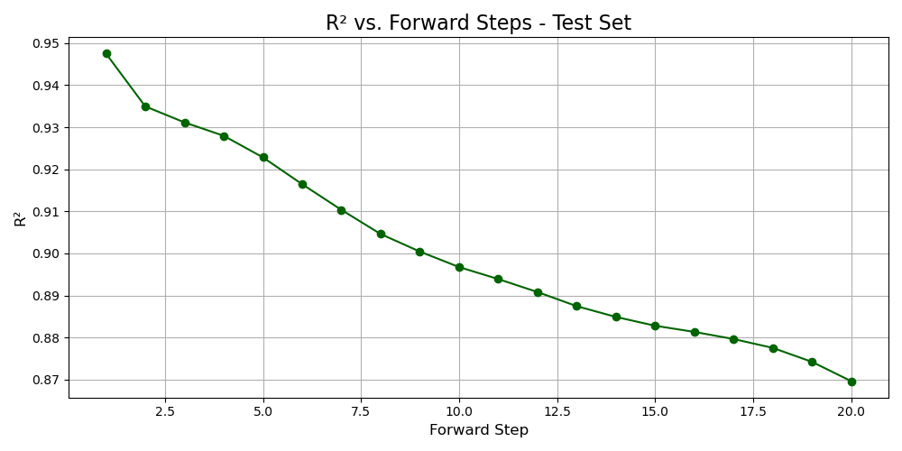
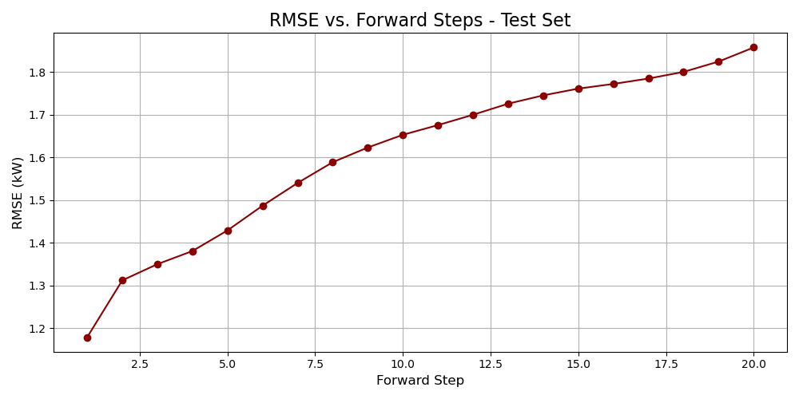
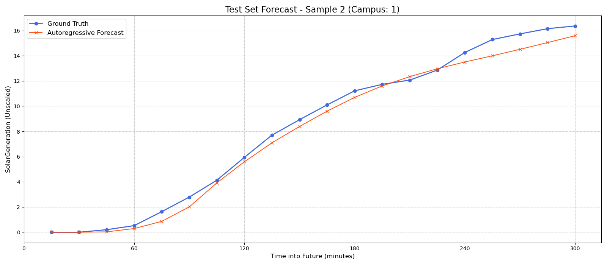
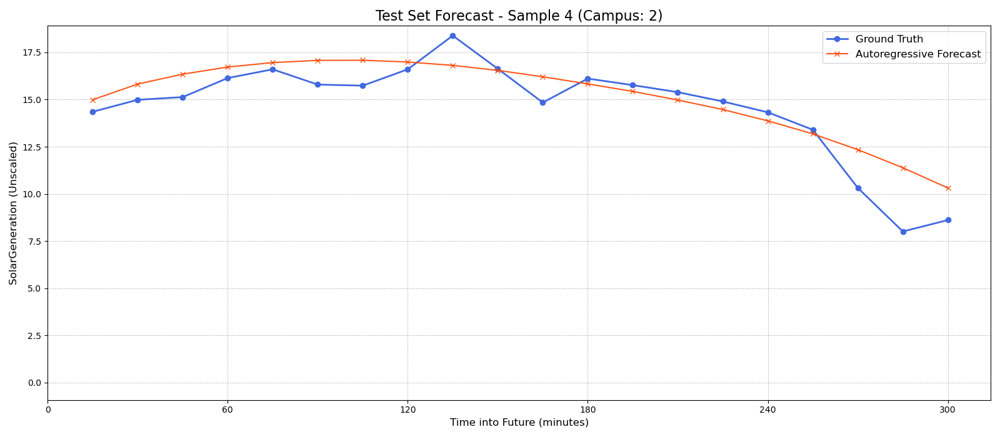
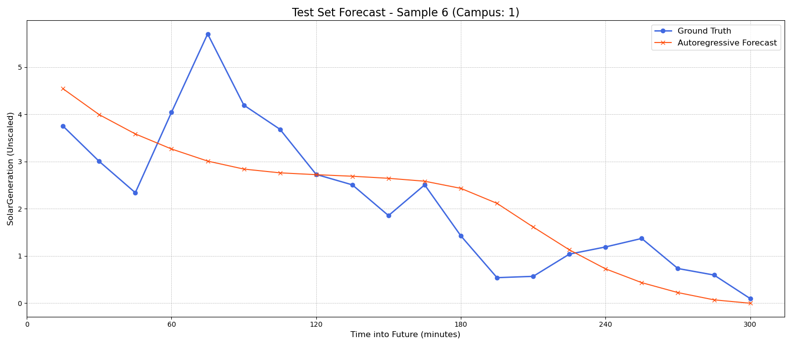
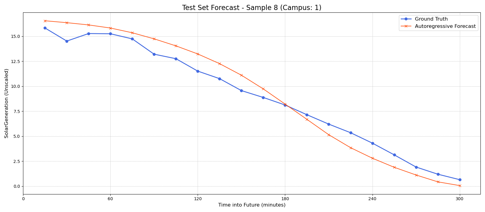
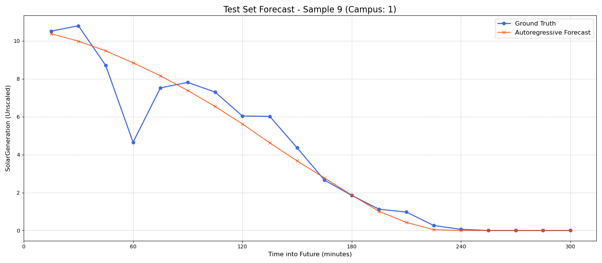
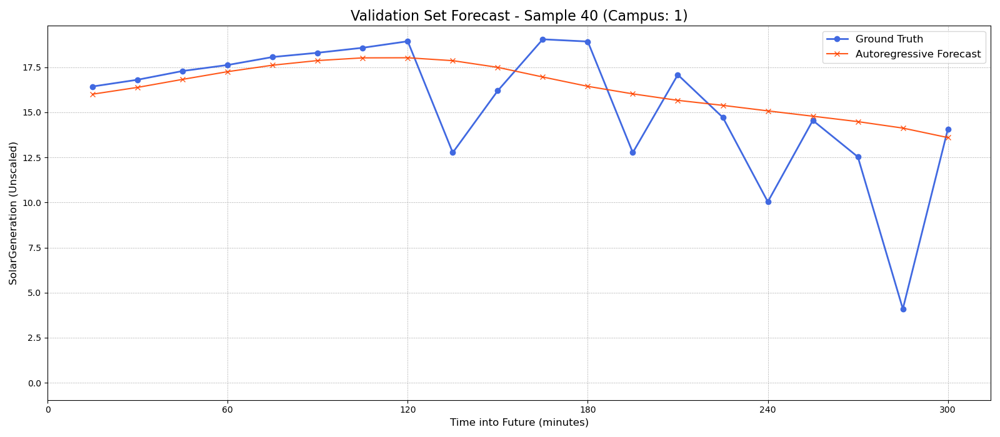

## Solar Power Forecasting with Transformers

This repository contains the code and documentation for a state-of-the-art deep learning model that predicts high-resolution solar power generation. Using a Transformer architecture, this project tackles the real-world challenge of forecasting a 5-hour energy output (in 15-minute intervals) based on historical generation data and weather forecasts.

The model achieves an exceptional **R-squared (R²) score of 0.9008** on the final test set, demonstrating its high accuracy and reliability.

This project is not just a demonstration of a powerful architecture, but a case study in practical ML engineering: making intuitive assumptions about messy solar data, testing whether those assumptions improve the model, and then hardening the training process against real forecasting behavior.

## Key Features

* **High-Resolution Forecasting:** Predicts solar generation for a 5-hour horizon at a 15-minute granularity.
* **Transformer Architecture:** Leverages the power of self-attention mechanisms to capture complex temporal dependencies.
* **Physics-Aware Data Preparation:** Normalizes site outputs, treats nighttime generation as true zero, and preserves uncertain daytime gaps as masked targets instead of forcing them into fake values.
* **Practical Feature Engineering:** Uses solar position and feature-age signals (`minutes_since_last_update`) to handle mismatched data frequencies without noisy interpolation.
* **Advanced Training Strategy:** Employs teacher forcing, staged semi-autoreg refinement, scheduled sampling, and finally a fully autoregressive polish.
* **Exposure Bias Mitigation:** The final training phase is fully autoregressive, forcing the model to learn from its own predictions and making it resilient to compounding errors.
* **State-of-the-Art Performance:** Achieves a final R² of **0.9008** and an RMSE of **1.6210 kW**.

## Performance

The project's success is best illustrated by the iterative improvement across the final training phases. The key was moving from a powerful but naive model (V4) to a hardened, aggressively fine-tuned final model (V6).

| Model Version | Strategy                             | Test Set R² | Test Set RMSE (kW) |
| :------------ | :----------------------------------- | :---------- | :----------------- |
| **V4**        | Elite Baseline (Pre-Polish)          | 0.8731      | \~1.95             |
| **V5**        | Standard Autoregressive Polish       | 0.8779      | 1.798              |
| **V6**        | **Aggressive Autoregressive Polish** | **0.9008**  | **1.621**          |

## Results Gallery

The plots below show how the final model behaves across the 20-step forecast horizon. The horizon covers 5 hours at 15-minute resolution, so later steps are harder because the model must keep using its own previous predictions.

### Horizon Metrics





The sample traces compare predicted solar generation against the observed curve. These examples are useful because solar forecasting is not only about hitting aggregate metrics: the model also needs to capture the daily generation shape, ramp-up, peak, and ramp-down behavior.

### Prediction Examples














### Data Preparation and Feature Engineering

In this project, I worked with a solar power dataset to make it suitable for training a high-performing Transformer model. Below, I'll explain the key steps in polishing the data and engineering features. These processes ensured the model could generalize well, handle inconsistencies, and capture important patterns like solar position and weather variability.

#### Data Polishing

The dataset comes from the **[UNISOLAR](https://github.com/CDAC-lab/UNISOLAR)** project by CDAC Lab at La Trobe University. UNISOLAR provides photovoltaic solar generation, weather, irradiance, and site metadata across La Trobe's five campuses, with solar generation recorded at 15-minute granularity and irradiance at hourly intervals. The original dataset is distributed through [Kaggle](https://www.kaggle.com/datasets/cdaclab/unisolar), and the project asks users to cite the UNISOLAR paper when using the data.

This project uses processed UNISOLAR-derived splits for forecasting. Each site has varying panel areas, leading to a wide range of power outputs (in kW). Training a model on this raw data would be tricky: it might struggle to learn consistent patterns across sites, and generalizing to new stations could be hard.

To simplify and standardize:
- **Power normalization**: I linearly scaled all power data to a uniform range of 0-20 kW. This assumes:
  - Light intensity is uniform across panels.
  - Panel efficiency doesn't depend on the station's size.
- **Why this works**: Solar power is proportional to panel area. By scaling to a "standard" range (based on observed peaks over years), it's like converting to power per square meter—making outputs comparable across sites.

Next, weather and irradiance data are city-wide (not per station). Feeding all stations from one city confused the model, as it got identical inputs but expected different outputs. Solution:
- **Site selection**: I picked one representative station per city (5 total). To choose, I trained a simple LSTM model on each and evaluated cross-city performance (R² and RMSE). The best performer per city was selected.
- **Splitting the data**: Validation and test sets were randomly sampled from these 5 stations.

Handling missing values:
- Empty strings in power data during nighttime (no sunlight) were filled with 0.
- Other gaps (e.g., midday data loss) were left as NaN and masked during training, so the model learns to handle them.

This polishing created a clean, consistent dataset ready for modeling.

#### Feature Engineering

The dataset has mismatched recording frequencies: power and weather data every 15 minutes, but cloud opacity and solar irradiance hourly. Instead of interpolating (which could add noise), I engineered smart features to let the model infer patterns itself.

- **Bridging time gaps**: Added a periodic feature called "minutes_since_last_update" to indicate how fresh the hourly data is. This helps the model weigh the reliability of inputs without forced interpolation.
- **Solar position features**: Calculated "zenith" and "azimuth" (sun's angular positions) and encoded them sinusoidally as inputs for both encoder and decoder. This guides the model in estimating future irradiance and weather, adding a natural "time-of-day" awareness.

These features enhanced the model's ability to predict accurately over 6-hour horizons, contributing to the high R² score.

#### Practical Assumptions

Several preprocessing choices were intentionally simple and intuition-driven:

- **Comparable site scale:** Solar generation was normalized because raw PV output strongly depends on site capacity. This assumes that, after scaling, different sites can share useful generation patterns even if they have different absolute sizes.
- **Representative campus sites:** Because weather and irradiance are campus-level features, using many sites from the same campus can give the model identical inputs with different targets. Selecting one representative site per campus reduces that ambiguity.
- **Different meanings of missing data:** Nighttime missing generation is treated as zero because solar panels should not generate power without sunlight. Daytime gaps are kept as missing targets and masked during loss calculation because they may represent sensor or reporting failure, not true zero production.
- **No forced interpolation for hourly features:** Hourly irradiance/cloud features are not smoothed into artificial 15-minute values. Instead, `minutes_since_last_update` lets the model learn how stale those inputs are.

These assumptions are not perfect physical laws; they are practical modeling choices that make the forecasting problem cleaner while preserving the most important solar behavior.


### Building the Model: From Baseline to State-of-the-Art

In this project, I developed a Transformer-based model for solar power forecasting. Below, I'll walk you through the key phases of development, highlighting the challenges, innovations, and improvements along the way. Each phase built on the last, tackling issues like exposure bias and over-regularization to achieve a final R² score of **0.9008**.

#### Phase 1 & 2: Establishing a Strong Baseline (Model V4)

The early stages focused on creating a robust Transformer model using proven techniques like **teacher forcing** (feeding the model the correct answers during training) and **scheduled sampling** (gradually introducing the model's own predictions).

Here's how it worked:
- **Handling missing values**: For sequences with gaps (e.g., [t0, t1, NaN, NaN, t4, t5]), the model autoregressively fills them in. It predicts `t2` using t0 and t1 as input, then uses that prediction to forecast `t3`, and so on.
- **Filling and refining**: Once gaps are filled (e.g., [t0, t1, predicted_t2, predicted_t3, t4, t5]), the model switches to teacher forcing mode, generating outputs based partly on its own predictions.
- **Iterative improvement**: In the next epoch, missing values in the dataset are replaced with predictions from the previous round. We also randomly sample some real values with probability ε to simulate real-world noise.

This approach yielded a solid R² score of **0.873**. However, it had a key limitation: **exposure bias**—the model wasn't fully trained to handle its own errors, which could cause performance drops in real-time forecasting.

#### Phase 3: Eliminating Exposure Bias with Autoregressive Fine-Tuning (Model V5)

To address exposure bias, I fine-tuned the model in a **fully autoregressive** setup—like removing the training wheels. Now, the model relied entirely on its own previous predictions as input for the next steps.

- **Why this matters**: This "hardening" process taught the model to self-correct and stay stable over long forecast horizons (e.g., predicting 6 hours ahead).
- **Results**: The R² improved to **0.878**, showing better resilience to accumulated errors.

#### The Final Push: Unleashing Full Potential (Model V6)

Analyzing Model V5 revealed it was slightly over-regularized—training and validation performance were too similar, indicating untapped capacity. I tested a bold hypothesis:

> "We can tolerate a growing gap between training and validation loss if validation performance keeps improving—the model has more to learn."

- **Adjustments**: Set `dropout = 0` (no regularization) and reduced `batch_size` for more precise updates.
- **Outcome**: This unlocked the model's full power, boosting the R² to a state-of-the-art **0.9008**.

These phases transformed a baseline model into a high-performing forecaster, even without future weather data. For implementation details, see `src/solar_forecasting/training/` (Phase 1–3 implementation modules) and `src/solar_forecasting/evaluation.py` for test-set metrics aligned with [`configs/default.yaml`](configs/default.yaml).

## Design Overview

The pipeline is organized around a small number of clear stages:

1. Load processed UNISOLAR-derived solar, weather, and time-feature CSV splits from `data/processed/`.
2. Apply per-campus z-score scaling using `data/processed/campus_scale.txt`.
3. Build sliding windows for each campus:
   - encoder input: 96 historical 15-minute steps
   - decoder input: 20 future 15-minute steps
4. Train the Transformer through increasingly realistic forecasting phases:
   - Phase 1: teacher forcing
   - Phase 2A: semi-autoregressive gap filling
   - Phase 2B: scheduled sampling
   - Phase 3: fully autoregressive fine-tuning
5. Evaluate the final checkpoint on `test_enhanced.csv` and regenerate diagnostic plots.

## Repository layout & quickstart

```
data/processed/         # scaler + splits (CSV/ZIPs are gitignored - see data/README.md)
configs/default.yaml    # paths, checkpoints, hyperparameters
docs/figures/           # legacy plots + regenerated diagnostic curves from evaluate.py
outputs/checkpoints/    # saved .pth files (ignored by git unless you intentionally track them)
pyproject.toml          # package metadata for editable installs and tooling
src/
  solar_forecasting/    # importable package with model, data, training, and evaluation logic
    constants.py
    dataset.py
    losses.py
    model.py
    scaling.py
    utils.py
    evaluation.py
    training/
      phase1.py
      phase2a.py
      phase2b.py
      phase2b_trainer.py
      phase3.py
  evaluate.py           # compatibility wrapper
  train/
    phase1_teacher_forcing.py          # compatibility wrappers
    phase2a_semi_autoregressive.py
    phase2b_scheduled_sampling.py
    phase3_autoregressive_finetune.py
scripts/run_pipeline.sh # runs all phases + evaluation sequentially
tests/                  # lightweight smoke tests
```

1. `python -m venv .venv && source .venv/bin/activate`
2. `pip install -r requirements.txt`
3. `pip install -e .`
4. Place the CSV splits under `data/processed/` (`train_selected_sites.csv`, `validation_enhanced.csv`, `test_enhanced.csv`) following [`data/README.md`](data/README.md).
5. Run training + evaluation locally:

```bash
python -m solar_forecasting.training.phase1
python -m solar_forecasting.training.phase2a
python -m solar_forecasting.training.phase2b
python -m solar_forecasting.training.phase3
python -m solar_forecasting.evaluation
```

or `./scripts/run_pipeline.sh`. The old paths under `src/train/` and `src/evaluate.py` are kept as compatibility wrappers.

Historical experiment branches (`Script`, `Dataset`, `Results`) are **deprecated**: their contents now live together on `main` as shown above.

> **Reporting numbers:** README table values (V4–V6) came from notebooks used during experimentation. Numbers from `evaluate.py` are the canonical reproducible signal once you regenerate checkpoints locally.

## Testing

This project includes a lightweight model smoke test in [`tests/test_model.py`](tests/test_model.py). It creates a small Transformer, passes fake encoder/decoder tensors through it, and verifies that the output shape is `[batch_size, forecast_steps, 1]`.

Run it after installing the project with development dependencies:

```bash
pip install -e ".[dev]"
pytest
```

This test does not validate forecasting accuracy; it is a fast structural check that the model accepts the expected tensor shapes and produces one prediction per forecast step.


## Model Architecture & Features

The model is a standard Transformer encoder-decoder architecture with the following key parameters:

* `d_model`: 128
* `nhead`: 8
* `num_encoder_layers`: 3
* `num_decoder_layers`: 3
* `dim_feedforward`: 512
* `dropout`: 0.1 (in initial phases), 0 (in final tuning)

### Feature Engineering

The model uses a rich set of engineered features to capture temporal and weather-related patterns.

* **Encoder Inputs:** Historical weather data, time-based cyclical features, and past solar generation.
* **Decoder Inputs:** Future-known time-based features and the model's own previous prediction for the target value.

## Key Learnings & Insights

* **The Limit of Teacher Forcing:** While effective for initial training, teacher forcing creates a model that is brittle in the real world. A dedicated autoregressive training phase is crucial for robustness.
* **The Value of Visual Assessment:**  metrics like R² and RMSE are vital, but visually inspecting prediction plots reveals the model's true behavioral intelligence—its ability to capture the diurnal shape of solar generation and react plausibly to weather changes.
* **Managing the Bias-Variance Tradeoff:** Don't be afraid to challenge a "good" model. The final leap in performance came from identifying that the model was over-regularized and making a bold, calculated decision to increase model variance in exchange for a significant reduction in bias.

## License

This project is licensed under the MIT License. See [`LICENSE`](LICENSE) for details.

## Acknowledgments

This project was made possible by the public availability of the **[UNISOLAR](https://github.com/CDAC-lab/UNISOLAR)** dataset from CDAC Lab at La Trobe University. A special thanks to the UNISOLAR authors for releasing a public benchmark for solar energy forecasting research.

* The original dataset can be found at: [UNISOLAR on GitHub](https://github.com/CDAC-lab/UNISOLAR)
* Dataset location: [UNISOLAR on Kaggle](https://www.kaggle.com/datasets/cdaclab/unisolar)
* Citation: S. Wimalaratne, D. Haputhanthri, S. Kahawala, G. Gamage, D. Alahakoon and A. Jennings, "UNISOLAR: An Open Dataset of Photovoltaic Solar Energy Generation in a Large Multi-Campus University Setting," 2022 15th International Conference on Human System Interaction (HSI), 2022, pp. 1-5, doi: [10.1109/HSI55341.2022.9869474](https://ieeexplore.ieee.org/document/9869474).
